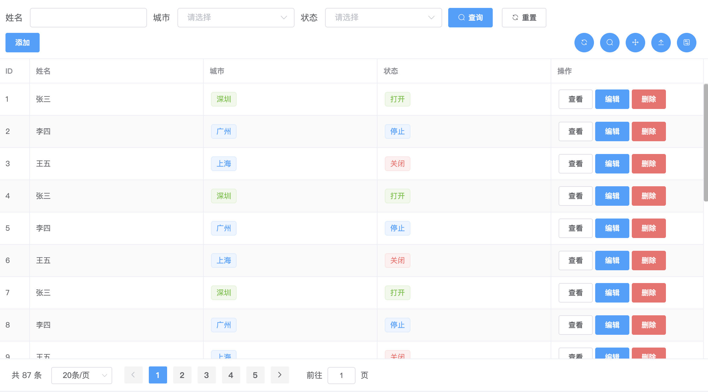

---
{
"title": "FastCrud",
"editLink": true
}
---

# 介绍
FastCrud （简称fs） 是基于Vue3的面向配置的crud开发框架，快速开发crud功能，可作为低代码平台的基础框架。   
继承并升华了D2CrudPlus的设计思想，基础逻辑简单，可扩展性强，丰富的示例，让你可以快速完成搬砖任务，更多的时间划水吹逼。

* 源码地址:[Github](https://github.com/fast-crud/fast-crud)  /  [Gitee](https://gitee.com/fast-crud/fast-crud)   
* 示例地址:
[antdv版](http://fast-crud.docmirror.cn/antdv/)  /  [element版](http://fast-crud.docmirror.cn/element/)   /  [naive-ui版](http://fast-crud.docmirror.cn/naive/)
* starter:
  [vben-starter](http://fast-crud.docmirror.cn/vben/) / 
  [cool-admin-starter](http://fast-crud.docmirror.cn/cool/)

[](https://lerna.js.org/)


::: tip   
注意：本项目的主要目标是实现一个`fs-crud`组件，帮助快速开发crud功能，`admin脚手架`并不是本项目的重点。     
你可以通过如下几种方式使用`fast-crud`
 * 直接使用示例中的 [fs-admin](http://fast-crud.docmirror.cn/admin/) ，特点是简单    
 * 也可以采用其他的 [admin开源项目](https://github.com/search?q=vue3+admin) ，然后集成 [fast-crud](http://fast-crud.docmirror.cn/guide/start/integration.html)     
 * 我们也挑选了一些比较好的`admin项目`集成`fast-crud`之后做成了 [admin-starter](http://fast-crud.docmirror.cn/demo/#二、admin脚手架starter)，助你快速上手    

:::

## 开发crud，快如闪电
1、只需简单编写crud配置
```js
const crudOptions= {
      columns: { //字段配置
        id: {// id字段
          title: "ID",
          type: "number", //字段类型
          column: { width: 50 },
          form: { show: false }
        },
        name: { // 姓名字段
          title: "姓名",
          type: "text", //文本类型字段
          search: { show: true } //显示查询
        },
        city: { //城市字段
          title: "城市",
          type: "dict-select", //选择类型字段
          search: { show: true }, //显示查询
          dict: dict({ //本地数据字典
            value: "id",
            label: "text",
            data: [
              { id: "sz", text: "深圳", color: "success" },
              { id: "gz", text: "广州", color: "primary" },
              { id: "bj", text: "北京" },
              { id: "wh", text: "武汉" },
              { id: "sh", text: "上海" }
            ]
          })
        },
        radio: {
          title: "状态",
          search: { show: true }, //显示查询
          type: "dict-radio", //单选类型字段
          dict: dict({ //远程数据字典
            url: "/dicts/OpenStatusEnum?single"
          })
        }
      }
    }
```

2、 一个完全体crud就出来了



## 特性
### 1. 面向配置的crud编程
* 根据crud配置快速开发crud功能,可作为低代码平台基础框架

### 2. 数据字典
* 支持本地和远程获取
* 配合select，轻松实现数据存的是value值，需要对应字典的label来展示的需求

### 3. 丰富的字段类型
* 通过配置字段类型“column.type”来简化配置
* 根据字段类型不同，自动生成不同的表单组件
* 支持自定义字段类型

### 4. 扩展组件
通过扩展自定义组件，扩展自定义类型

### 5. 多UI支持
支持Antdv、ElementPlus、NaiveUI，你喜欢哪个就用哪个

## 请先了解
本文档假设您已熟悉Vue3/antdvue/elementplus/naiveui等基础知识
### 1. Vue3
Github: <https://github.com/vuejs/vue-next>  
文档：<https://v3.cn.vuejs.org/guide/introduction.html>

### 2. ElementPlus
Github: <https://github.com/element-plus/element-plus>  
文档：<https://element-plus.org/#/zh-CN/component/installation>

### 3. Antdvue
Github: <https://github.com/vueComponent/ant-design-vue>  
文档：<https://2x.antdv.com/components/overview/>


### 4. NaiveUI
Github: <https://github.com/TuSimple/naive-ui>  
文档：<https://www.naiveui.com/>


